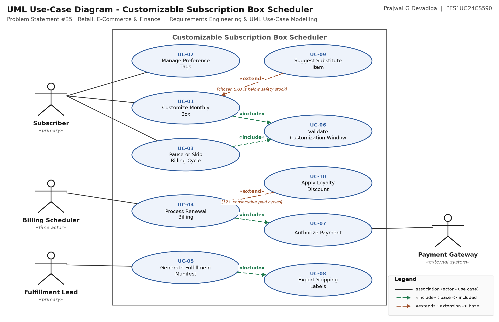

# Lab 1 — Requirements Engineering & UML Use-Case Modelling

**Prajwal G Devadiga** · **PES1UG24CS590**  
Software Engineering - Lab 1 — Requirements Engineering & UML Use-Case Modelling  
Problem Statement #35 | Retail, E-Commerce & Finance

## Scenario

> **Customizable Subscription Box Scheduler**  
> A subscription box portal where subscribers customize monthly product selections (e.g. books, coffee, snacks) based on preference tags, with support for pausing or skipping billing cycles.

## Deliverables

| # | Deliverable | Files |
|---|---|---|
| 1 | Requirements Table — 5 FRs + 2 NFRs with ID, Type, Description, Priority, Acceptance Criteria, Rationale, Comments | [`.docx`](docs/01_Requirements_Table.docx) · [`.xlsx`](docs/01_Requirements_Table.xlsx) · [`.pdf`](docs/01_Requirements_Table.pdf) |
| 2 | UML Use-Case Diagram — 4 actors, 10 use cases, 4 `«include»` + 2 `«extend»` | [`.pdf`](docs/02_UseCase_Diagram.pdf) · [`.png`](docs/02_UseCase_Diagram.png) · [editable `.drawio`](diagram/subscription_box_usecase.drawio) |
| 3 | Use-Case Flow — UC-01 Customize Monthly Box, preconditions, postconditions, main success scenario, 2 alternate flows | [`.docx`](docs/03_UseCase_Flow_UC-01.docx) · [`.pdf`](docs/03_UseCase_Flow_UC-01.pdf) |

---

## 1. Requirements Table

| Req ID | Type | Priority | Description ("The system shall …") |
|---|---|---|---|
| **FR-001** | Functional | High | The system shall allow a subscriber to swap items in the upcoming monthly box or pause that delivery, at any point up to 48 hours before the box's billing renewal timestamp (measured in UTC). |
| **FR-002** | Functional | High | The system shall allow a subscriber to add or remove preference tags (e.g. dark-roast, sci-fi, nut-free) drawn from the curated tag vocabulary, and shall regenerate the recommended contents of the next unlocked box from the updated tag set. |
| **FR-003** | Functional | Medium | The system shall allow a subscriber to skip the next billing cycle up to 3 times in any rolling 12-month period, deferring the renewal date by exactly one cycle without raising a charge. |
| **FR-004** | Functional | High | On a box's renewal date the system shall lock the box contents, submit one payment authorization for the subscription amount to the Payment Gateway, and retry a soft decline at most twice at 24-hour intervals before suspending the subscription. |
| **FR-005** | Functional | High | The system shall allow the Fulfillment Lead to generate a fulfillment manifest for a selected billing cycle, grouped by warehouse zone, and export it together with the corresponding shipping labels. |
| **NFR-001** | Nonfunctional - Performance & Security | High | The fulfillment manifest generator shall export the shipping labels for a 10,000-box monthly cycle in under 60 seconds over an authenticated TLS 1.2+ session, while the portal is serving peak subscriber traffic. |
| **NFR-002** | Nonfunctional - Reliability & Availability | High | The subscriber customization service shall achieve at least 99.9% availability measured per calendar month, and shall not be taken offline for planned maintenance during the 72 hours preceding any billing renewal date. |

<details>
<summary><b>Acceptance criteria, rationale and peer-critique comments (click to expand)</b></summary>

#### FR-001 — Functional _(given with the problem statement)_

**Description.** The system shall allow a subscriber to swap items in the upcoming monthly box or pause that delivery, at any point up to 48 hours before the box's billing renewal timestamp (measured in UTC).

**Acceptance criteria.** PASS: a swap or pause submitted at renewal minus 48:00:01 is accepted, the stored box contents change, and the cycle's fulfillment manifest is refreshed within 5 minutes. FAIL: the request is rejected inside the window, or the manifest still shows the previous contents after 5 minutes.

**Rationale.** Late-cycle customization is the core value proposition of the product. 48 hours is the latest point at which the warehouse can still re-pick a box before wave planning.

**Peer critique → revision.** Peer: "Whose clock is the 48 h measured on?" -> revised to state the renewal timestamp explicitly in UTC. (Given requirement, refined.)

#### FR-002 — Functional

**Description.** The system shall allow a subscriber to add or remove preference tags (e.g. dark-roast, sci-fi, nut-free) drawn from the curated tag vocabulary, and shall regenerate the recommended contents of the next unlocked box from the updated tag set.

**Acceptance criteria.** PASS: after a tag is saved, the next-box recommendation is regenerated and every recommended SKU satisfies all exclusion tags. FAIL: any recommended SKU violates an exclusion tag, or the recommendation is unchanged after save.

**Rationale.** Preference tags are the only input that drives personalization; exclusion tags such as nut-free additionally carry an allergen-safety obligation.

**Peer critique → revision.** Peer: "nut-free is a safety constraint, not a taste preference." -> exclusion tags are now applied as hard filters, not ranking weights.

#### FR-003 — Functional

**Description.** The system shall allow a subscriber to skip the next billing cycle up to 3 times in any rolling 12-month period, deferring the renewal date by exactly one cycle without raising a charge.

**Acceptance criteria.** PASS: on the 3rd skip the renewal date moves forward one cycle, no payment authorization is sent, and the subscription stays Active; a 4th skip within the same 12 months is refused with reason code SKIP_LIMIT_REACHED. FAIL: a charge is raised for a skipped cycle, or a 4th skip is accepted.

**Rationale.** Skipping retains subscribers who would otherwise cancel outright, while the cap keeps recurring revenue forecastable.

**Peer critique → revision.** Peer: "Table says nothing about the 4th attempt." -> explicit refusal reason code added to the acceptance criteria.

#### FR-004 — Functional

**Description.** On a box's renewal date the system shall lock the box contents, submit one payment authorization for the subscription amount to the Payment Gateway, and retry a soft decline at most twice at 24-hour intervals before suspending the subscription.

**Acceptance criteria.** PASS: contents are frozen at the renewal timestamp, at most 3 authorizations are attempted, and after the 3rd consecutive decline the subscription moves to Suspended and the subscriber is notified. FAIL: contents change after lock, a 4th authorization is attempted, or a fully declined subscription remains Active.

**Rationale.** Recurring billing is the revenue event; bounded retries recover soft declines without breaching card-scheme retry limits.

**Peer critique → revision.** Peer: "Define soft vs hard decline." -> hard declines (stolen / closed card) are excluded from retry and suspend immediately; recorded in the glossary.

#### FR-005 — Functional

**Description.** The system shall allow the Fulfillment Lead to generate a fulfillment manifest for a selected billing cycle, grouped by warehouse zone, and export it together with the corresponding shipping labels.

**Acceptance criteria.** PASS: the manifest lists every paid, non-skipped box for the cycle exactly once, grouped by zone, and the exported label count equals the manifest line count. FAIL: a paid box is missing or duplicated, or label count does not equal line count.

**Rationale.** The warehouse cannot pick or ship without a per-cycle manifest; it is the hand-off point between the portal and physical fulfillment.

**Peer critique → revision.** Peer: "Do paused / skipped boxes appear on the manifest?" -> scope narrowed to paid, non-skipped boxes only.

#### NFR-001 — Nonfunctional - Performance & Security _(given with the problem statement)_

**Description.** The fulfillment manifest generator shall export the shipping labels for a 10,000-box monthly cycle in under 60 seconds over an authenticated TLS 1.2+ session, while the portal is serving peak subscriber traffic.

**Acceptance criteria.** PASS: under simulated peak load, 10 consecutive benchmark runs complete with a 95th percentile under 60 s, and an unauthenticated call to the export endpoint returns HTTP 401 with no label data. FAIL: the 95th percentile exceeds 60 s, or any unauthenticated request returns label data.

**Rationale.** Labels are produced in a narrow window on dispatch day; a slow export delays every shipment, and an unprotected one exposes 10,000 subscriber addresses.

**Peer critique → revision.** Peer: "Is 60 s an average or a worst case?" -> restated as the 95th percentile over 10 runs. (Given requirement, refined.)

#### NFR-002 — Nonfunctional - Reliability & Availability

**Description.** The subscriber customization service shall achieve at least 99.9% availability measured per calendar month, and shall not be taken offline for planned maintenance during the 72 hours preceding any billing renewal date.

**Acceptance criteria.** PASS: the monthly uptime report shows 43 minutes or less of unplanned downtime and zero planned maintenance windows inside any 72-hour pre-renewal freeze. FAIL: downtime exceeds 43 minutes, or a maintenance window overlaps a freeze period.

**Rationale.** FR-001 gives subscribers only a 48-hour window to change a box; an outage inside that window silently removes a contractual right and is a direct cancellation driver.

**Peer critique → revision.** Peer: "Tie the freeze window to the 48 h rule in FR-001." -> freeze widened to 72 h so it fully covers the customization cut-off plus a safety margin.

</details>

> FR-001 and NFR-001 are the requirements supplied with Problem Statement #35. FR-002–FR-005 and NFR-002 are student-authored. The *Comments* column records the peer-critique round (Lab step 3) and the revision each comment produced.

---

## 2. UML Use-Case Diagram



Submit [`docs/02_UseCase_Diagram.pdf`](docs/02_UseCase_Diagram.pdf). To edit, open [`diagram/subscription_box_usecase.drawio`](diagram/subscription_box_usecase.drawio) at [app.diagrams.net](https://app.diagrams.net) via **File → Open From → Device**.

### Actors

| Actor | Classification | Goal in the system |
|---|---|---|
| **Subscriber** | Primary | Customizes the box, manages preference tags, pauses or skips billing cycles. |
| **Fulfillment Lead** | Primary | Generates the per-cycle manifest and exports the shipping labels. |
| **Billing Scheduler** | Secondary (time actor) | Fires on each renewal date and starts the billing run. |
| **Payment Gateway** | Secondary (external system) | Authorizes, declines or refunds the subscription charge. |

### Use cases

| UC ID | Use Case | Actor / relationship | Traces to |
|---|---|---|---|
| **UC-01** | Customize Monthly Box | Subscriber | FR-001, FR-002 |
| **UC-02** | Manage Preference Tags | Subscriber | FR-002 |
| **UC-03** | Pause or Skip Billing Cycle | Subscriber | FR-001, FR-003 |
| **UC-04** | Process Renewal Billing | Billing Scheduler | FR-004 |
| **UC-05** | Generate Fulfillment Manifest | Fulfillment Lead | FR-005, NFR-001 |
| **UC-06** | Validate Customization Window | (included by UC-01, UC-03) | FR-001, NFR-002 |
| **UC-07** | Authorize Payment | Payment Gateway | FR-004 |
| **UC-08** | Export Shipping Labels | (included by UC-05) | FR-005, NFR-001 |
| **UC-09** | Suggest Substitute Item | (extends UC-01) | FR-002 |
| **UC-10** | Apply Loyalty Discount | (extends UC-04) | FR-004 |

### `«include»` and `«extend»` relationships

| Stereotype | From | To | Why |
|---|---|---|---|
| `«include»` | UC-01 | UC-06 | every customization must first check the 48 h window |
| `«include»` | UC-03 | UC-06 | pause / skip is bound by the same 48 h window |
| `«include»` | UC-04 | UC-07 | a renewal always authorizes a payment |
| `«include»` | UC-05 | UC-08 | a manifest is always exported with its labels |
| `«extend»` | UC-09 | UC-01 | condition: chosen SKU is below safety stock |
| `«extend»` | UC-10 | UC-04 | condition: 12+ consecutive paid cycles |

*Reading the arrows:* an `«include»` arrow points **from the base use case to the included one** (the included behaviour always runs); an `«extend»` arrow points **from the extending use case back to the base** (the behaviour runs only when its condition holds).

---

## 3. Use-Case Flow — UC-01 Customize Monthly Box

- **Primary Actor:** Subscriber
- **Secondary Actor:** Catalog / Inventory Service (supporting)
- **Scope & Level:** Customizable Subscription Box Scheduler (portal) - user-goal level
- **Trigger:** Subscriber opens "My Next Box" and selects Customize.
- **Traces to:** FR-001, FR-002, NFR-002
- **Relationships:** «include» UC-06 Validate Customization Window; extended by «extend» UC-09 Suggest Substitute Item

**Preconditions**

1. The Subscriber is authenticated and the subscription status is Active (not Suspended or Cancelled).
2. A box exists for the current cycle and has not yet been locked for billing by UC-04.
3. Server time is more than 48 hours before the subscription's renewal timestamp (UTC).
4. The catalog for the cycle is published and live stock levels are available.

**Postconditions**

1. The box item list is persisted with the new selections and an incremented box version number.
2. An audit record (subscriber, old contents, new contents, timestamp) is written.
3. The cycle's fulfillment manifest is flagged for refresh within 5 minutes.
4. A confirmation showing the new contents and the remaining customization window is sent to the Subscriber.
5. Failure guarantee: on any error the previously confirmed contents remain intact, stock reservations are released, and no manifest refresh is triggered.

**Main Success Scenario**

1. Subscriber selects "Customize" on the next scheduled box.
2. System performs «include» UC-06 Validate Customization Window: it computes the time remaining to the renewal timestamp and confirms it is greater than 48 hours.
3. System displays the current box contents, a countdown to the customization cut-off, and the catalog filtered by the Subscriber's preference tags (FR-002).
4. Subscriber removes one item from the box and selects a replacement SKU from the filtered catalog.
5. System checks live stock for the chosen SKU and reserves one unit against the cycle.
6. Subscriber repeats steps 4-5 until the box holds the item count contracted by the plan, then selects "Save changes".
7. System validates the box against the plan: item count, exclusion tags (e.g. nut-free), and price ceiling.
8. System persists the new contents, increments the box version, and writes the audit record.
9. System flags the cycle's fulfillment manifest for refresh and displays a confirmation with the new contents and the customization deadline.
10. Use case ends successfully.

**Alternate Flows**

*5a. Selected item is out of stock  (extension point: item unavailable -> «extend» UC-09 Suggest Substitute Item)*

- 5a1. The stock check at step 5 returns zero available units for the chosen SKU.
- 5a2. System marks the SKU "Out of stock" and offers up to 3 substitutes carrying the same preference tags.
- 5a3. Subscriber selects a substitute; the flow resumes at step 5 with the substitute SKU.
- 5a4. If the Subscriber rejects every substitute, the original item is left in the box, the system shows "No change made to this slot", and the flow resumes at step 6.

*2a. Customization window has already closed  (less than 48 h to renewal)*

- 2a1. UC-06 Validate Customization Window returns status CLOSED.
- 2a2. System displays the box read-only with the message "This box locked at [renewal timestamp]; changes now apply to your next box."
- 2a3. System offers two onward options: "Customize next month's box" and "Skip next cycle" (UC-03).
- 2a4. If the Subscriber picks either option the corresponding use case starts; otherwise the use case ends with no change to the box.

**Exception Flow**

- 8a. Persistence failure - the save transaction is rolled back, all stock reservations from step 5 are released, an error with a Retry action is shown, and the box remains at its previous version.

---

## Repository layout

```
docs/     final deliverables (submit these)
diagram/  editable draw.io source for the use-case diagram
build/    scripts that generate everything in docs/ from content.py
```

## Regenerating the deliverables

`build/content.py` is the single source of truth — every table, diagram label and flow step is written once there. Edit it, then:

```bash
pip install python-docx openpyxl reportlab matplotlib
cd build
python build_diagram.py   # docs/02_UseCase_Diagram.pdf + .png, diagram/*.drawio
python build_docs.py      # docs/01_*.docx/.xlsx/.pdf, docs/03_*.docx/.pdf
python build_readme.py    # this README
```
