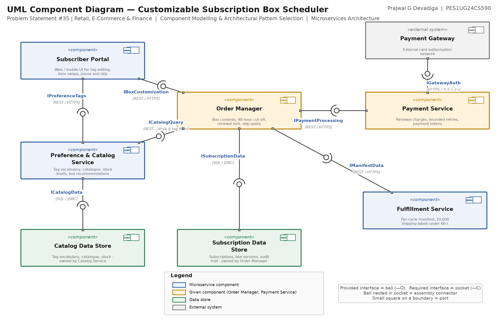

# Lab 3 — Component Modelling & Architectural Pattern Selection

**Prajwal G Devadiga** · **PES1UG24CS590**  
Software Engineering - Lab 3 · PES University, Dept. of CSE

Problem Statement #35 | Retail, E-Commerce & Finance — *Customizable Subscription Box Scheduler*

## Deliverables

| File | What it is |
|---|---|
| [`docs/01_Component_Diagram.pdf`](docs/01_Component_Diagram.pdf) ([png](docs/01_Component_Diagram.png)) | UML component diagram — 7 components, 8 interfaces in ball-and-socket notation |
| [`docs/02_Architecture_Justification.pdf`](docs/02_Architecture_Justification.pdf) ([docx](docs/02_Architecture_Justification.docx)) | One-page justification: style comparison, two reasons, security advantage, performance benefit |
| [`diagram/subscription_box_component.drawio`](diagram/subscription_box_component.drawio) | Editable draw.io source |

## Architecture

**Microservices Architecture.** The manifest export and the subscriber portal have bursty loads on different schedules, and billing failures must not take the 48-hour customization window down with them.

## Components

| Component | Responsibility |
|---|---|
| **Subscriber Portal** | Web / mobile UI for tag editing, item swaps, pause and skip |
| **Preference & Catalog Service** | Tag vocabulary, catalogue, stock levels, box recommendations |
| **Order Manager** *(given)* | Box contents, 48-hour cut-off, renewal lock, skip quota |
| **Subscription Data Store** | Subscriptions, box versions, audit trail - owned by Order Manager |
| **Catalog Data Store** | Tag vocabulary, catalogue, stock - owned by Catalog Service |
| **Payment Service** *(given)* | Renewal charges, bounded retries, payment tokens |
| **Payment Gateway** *(external)* | External card authorisation network |
| **Fulfillment Service** | Per-cycle manifest, 10,000 shipping labels under 60 s |

## Interfaces

| Interface | Provided by | Required by | Protocol |
|---|---|---|---|
| `IBoxCustomization` | Order Manager | Subscriber Portal | REST / HTTPS |
| `IPreferenceTags` | Preference & Catalog Service | Subscriber Portal | REST / HTTPS |
| `ICatalogQuery` | Preference & Catalog Service | Order Manager | REST - stock & tag filter |
| `IPaymentProcessing` | Payment Service | Order Manager | REST / HTTPS |
| `IManifestData` | Order Manager | Fulfillment Service | REST / HTTPS |
| `IGatewayAuth` | Payment Gateway | Payment Service | HTTPS / TLS 1.2+ |
| `ISubscriptionData` | Subscription Data Store | Order Manager | SQL / JDBC |
| `ICatalogData` | Catalog Data Store | Preference & Catalog Service | SQL / JDBC |

`IPaymentProcessing` (Order Manager → Payment Service) is the interface given in the lab handout; the rest were identified from the Lab 1 requirements.
